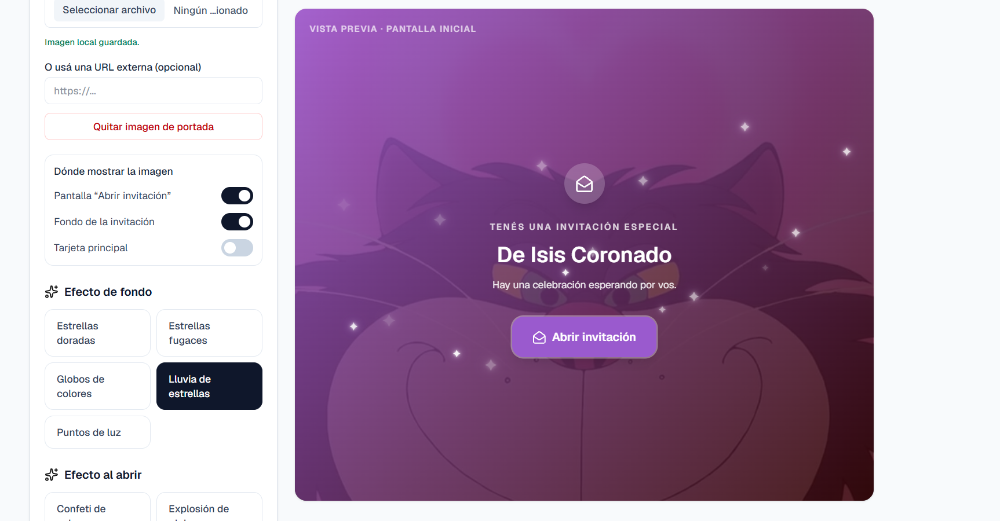
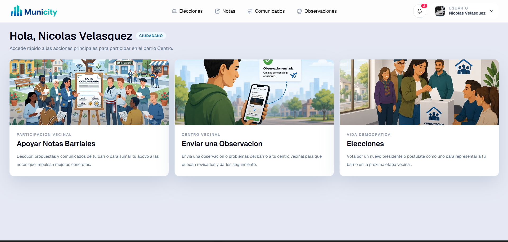
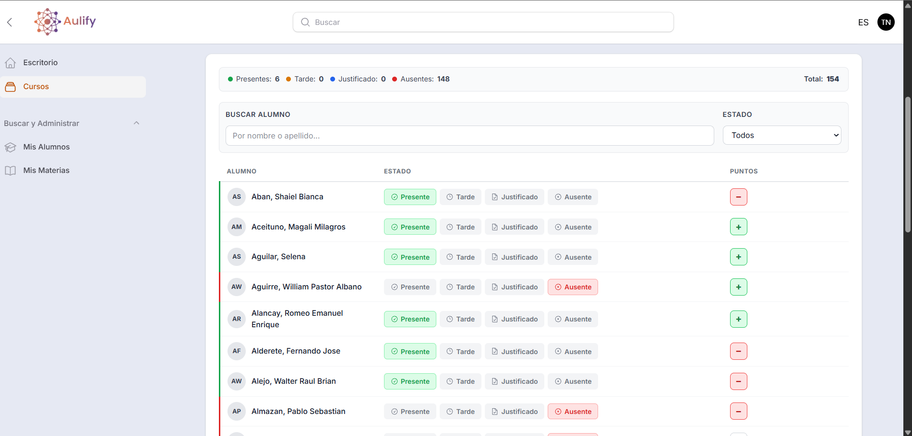
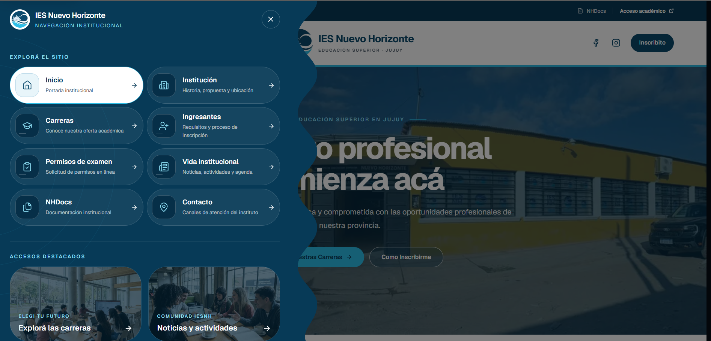

# Hola, soy Nicolás Velásquez 👋

Estudio la Tecnicatura Superior en Desarrollo de Software. Me gusta crear aplicaciones que resuelvan problemas cotidianos, desde la interfaz hasta el backend.

## Proyectos destacados

- **[Habitos-Traked](https://github.com/Nyckush/Habitos-Traked)** — aplicación móvil para registrar y seguir hábitos. Desarrollada con React Native, Expo y TypeScript, con un backend en Laravel. [Ver sitio](https://habitostraked.iunex.com.ar/admin/login).
- **[Tudia](https://github.com/Nyckush/Tudia-)** — sistema para gestionar eventos e invitados. Combina Next.js y TypeScript en el frontend con Java y Spring Boot en el backend. [Ver sitio](https://tudia.iunex.com.ar/login).

  

- **[MuniCity](https://github.com/Nyckush/MuniCity)** — proyecto web con frontend en JavaScript y backend en Java y Spring Boot.

  

- **Aulify** — aplicación para la gestión de cursos y asistencia de estudiantes. [Ver sitio](https://aulify.softlixs.com/admin).

  

- **IES Nuevo Horizonte** — sitio web institucional con información académica y accesos para estudiantes. [Ver sitio](https://iesnuevohorizonte.com/).

  

## Tecnologías que uso en mis proyectos

Podés explorar el resto de mi trabajo en [mis repositorios](https://github.com/Nyckush?tab=repositories).
